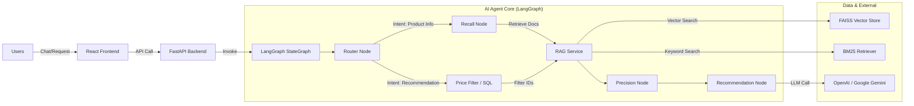

# System Documentation: AI Product Agent

## 1. 📐 System Architecture

The system is built on a **Microservices** architecture (separating Frontend/Backend) and uses **LangGraph** to manage AI conversation flows.

### Data Flow Diagram (High-Level)

### Key Components
1.  **Backend API (FastAPI)**: Handles requests, manages sessions (`thread_id`), and streaming responses (SSE).
2.  **Agent Core (LangGraph)**:
    *   `router_node`: Classifies user intent (General, Product Info, Comparison, Recommendation).
    *   `recall_node`: Retrieves relevant documents from the Knowledge Base.
    *   `precision_node`: Filters, reranks, and selects the most accurate information.
    *   `recommendation_node`: Synthesizes information and generates the final response.
    *   `price_filtering_node`: Queries the SQL database to filter products by precise price/brand.
3.  **Data Layer**:
    *   **Vector Store (FAISS)**: Stores product embeddings for semantic search.
    *   **SQLite Database**: Stores prices and structured information for precise filtering (Price Tool).

---

## 2. 🔌 APIs & Integrations

### Backend API Endpoints
The backend runs on default port `8006`.

| Method | Endpoint | Description | Payload |
| :--- | :--- | :--- | :--- |
| `GET` | `/` | Checks server status. | N/A |
| `GET` | `/health` | Health check for monitoring services. | N/A |
| `POST` | `/chat` | Sends message and receives full response. | `{"message": "...", "language": "vi", "thread_id": "..."}` |
| `POST` | `/chat/stream` | Sends message and receives streaming response (SSE). | `{"message": "...", "language": "vi", "thread_id": "..."}` |

### External Integrations
*   **OpenAI API**: Used for LLM (`gpt-4o-mini`, `gpt-3.5-turbo`) and Embeddings (`text-embedding-3-small`).
*   **Google Gemini API**: Used as an alternative fallback for LLM (`gemini-1.5-pro`) and Embeddings (`text-embedding-004`).
*   **LangChain / LangGraph**: Main framework for building Agent logic and RAG.

---

## 3. 🧠 AI Model/Algorithms

### AI Models
The system supports multiple models, configured via environment variables (`.env`):
*   **LLM (Language Model)**:
    *   Default: `OpenAI GPT-4o-mini` (balance between speed and cost).
    *   Fallback/Option: `Google Gemini 1.5 Pro` (Large context window).
    *   Tasks: Intent Classification, Re-ranking documents, Answer Synthesis.
*   **Embedding Model**:
    *   `OpenAI text-embedding-3-small` or `Google text-embedding-004`.
    *   Tasks: Converts product text into vectors for similarity search.

### Algorithms & Techniques
1.  **Hybrid Search (Retrieval)**:
    *   Combines **Vector Search (FAISS)** (semantic search) and **Keyword Search (BM25)** (exact keyword search).
    *   Helps increase coverage (Recall) for specific keywords (model codes, technical specs).
2.  **Reranking**:
    *   Uses LLM to re-score found top documents, filtering out irrelevant results before passing to context for answering.
3.  **Query Expansion**:
    *   Expands user queries to cover more aspects (e.g., "phone with good camera" -> "high resolution camera, good night mode").
4.  **Router Agent**:
    *   Uses **Hybrid Routing** approach: Combines keyword rules (Keyword-based fallback) and LLM classification (Semantic Classification) to accurately route user requests.

---

## 4. 📊 Dataset

### Data Source & Size
*   **Source**: Data is crawled/imported from JSON files in `data/clean/` directory.
*   **Main Files**:
    *   `product_prices.json`: Contains price info (VND, USD, YEN) and model names of ~200 products (mainly Apple, Samsung).
    *   `phone_vi.json`: Contains detailed info (specs, description, usage) in Vietnamese.
*   **Data Structure**:
    *   Each product includes: `Brand`, `Model Name`, `Price`, `Specifications` (RAM, Battery, Screen), `Recommended Usage`.

### Vector Store Format
*   Text data is chunked with size `4000` characters (ensuring product context retention) and overlap `200`.
*   Stored as FAISS index at `data/vector_store/index.faiss`.

---

## 5. 🚀 Evaluation

Currently, the system uses manual evaluation and Integration Testing.

*   **Integration Tests**: File `tests/verify_agent_integration.py` contains real-world flow test scenarios (e.g., "Find cheapest Samsung phone").
*   **Metrics (Qualitative)**:
    *   **Retrieval Accuracy**: Verification if returned product model/IDs match requirements in Database.
    *   **Response Quality**: Manual assessment of naturalness and accuracy of the answer.
*   **Token Usage**: System measures input/output token counts via `TokenUsageHandler` to track operating costs.

---

## 6. 🔒 Security & Ethics

### Data Privacy
*   **Session Isolation**: Conversation data is isolated based on `thread_id`. No context sharing between different users.
*   **No PII Storage**: The system **does not** permanently store user Personally Identifiable Information (PII) in the database. Memory only exists within the session lifecycle (Checkpointer memory).
*   **API Key Protection**: API keys (OpenAI, Google) are managed via server-side environment variables, not exposed to the client.

### Ethics & Safety
*   **Content Filtering**: Relies on default safety filters of model providers (OpenAI/Google Safety Filters) to prevent harmful content.
*   **Truthfulness**: Agent prompts are designed to answer solely based on provided context (RAG), minimizing hallucinations regarding price or specs.

---

## 7. 📈 Performance Metrics

*   **Latency**:
    *   Average API response: ~2-5 seconds (dependent on LLM speed and Graph steps).
    *   Streaming allows users to see initial response faster (<1 second).
*   **Retrieval Performance**:
    *   `top_k` documents: 4-20 (customizable per strategy).
    *   Vector Search time: <100ms (with local FAISS).

---

## 8. ⭐ Limitations & Future Work

### Limitations
1.  **Static Data**: Product data is based on static JSON/DB files, requiring manual updates or periodic crawl scripts. Prices may not reflect real-time changes.
2.  **Vietnamese Understanding**: Some slang or complex local phrasing might pose challenges for information extraction (Extraction Chain).
3.  **Memory**: Current conversation memory is simple (window buffer), potentially losing context if conversation is too long.

### Future Work
1.  **Automated Evaluation**: Integrate frameworks like **Ragas** or **DeepEval** to automatically evaluate accuracy (Faithfulness, Answer Relevance).
2.  **External Knowledge**: Connect Google Search API to supplement information for out-of-catalog questions.
3.  **User Personalization**: Store user preferences (Favorite Brand, budget) in long-term database for better personalized experience.
4.  **Advanced SQL Agent**: Fully convert to Text-to-SQL for complex comparison queries (e.g., "Get top 5 phones under 10m with battery over 5000mAh").
